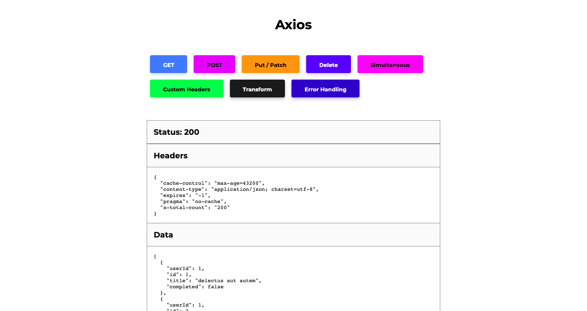

# axios-101

Here important axios features are used to work with REST apis which are of **Json Placeholder's API**. This is used in Next JS app with TypeScript.

## Axios Functionalities Used

- CRUD operations
- Error Handling
- Custom Headers
- Cancel Token
- Transform Data
- Simultaneous Request
- Axios Globals
- Axios Instance

## App Images

## License

[MIT](./LICENSE)
